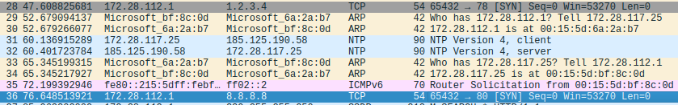

# Pet project: Port scanner v2
## Overview
A port scanner, building and utlizing raw packets with Python native libraries.

For learning purposes of;
1. Packet crafting
    
2. Network traffic
3. Defense Mechanics on network infrastructure
4. How to bypass the defense
5. And how to catch those bypassing traffics

## Features
1. SYN packet crafting
2. Dummy TCP server image build
3. WIP

## Project Architecture
- [Scanner core code files](core/)
- [Dummy target server code files](target/)
    - VM
    - Docker

## Project docs
- [Specific project plans](docs/steps.md)
- [Development Log](docs/development_log.md)
- [Snapshots, images](docs/images)

