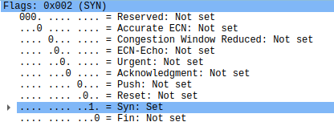

## Mar 7 - Mar 10
### Done 
- simple packet header crafter
- simple target server code, docker image
- simple target tester developed

### Checked
- header crafter sends out packet as configured
    - 
    - 
- server (target_server.py inside docker) responds to target_tester.py
    - 

### What to do next
- headercraft.py sent SYN packets doesn't get response, threeway handshake never answered back.     -> research and fix.