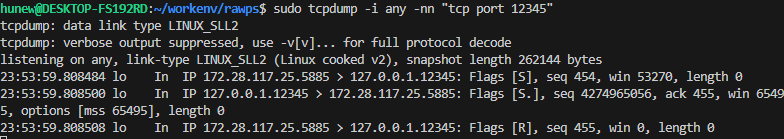

## Mar 7 - Mar 10
### Done 
- simple packet header crafter
- simple target server code, docker image
- simple target tester developed

### Checked
- header crafter sends out packet as configured
    - 
    - 
- server (target_server.py inside docker) responds to target_tester.py
    - 

### What to do next
- headercraft.py sent SYN packets doesn't get response, threeway handshake never answered back.     -> research and fix.

## Mar 11
I have two hypotheses,
1. TCP checksum is a pseudo currently -> Which can be the main issue of packet dropping silently
2. IP address is the eth0 now. eth0 -> 127.0.0.1 could cause issues.

After some code mending and some experiments:
- Pseudo checksum was the root cause here. After computing a legitimate checksum and repacking it as the rightful header, I could get a response
- 
- IP address not being 127.0.0.1 isn't the problem

